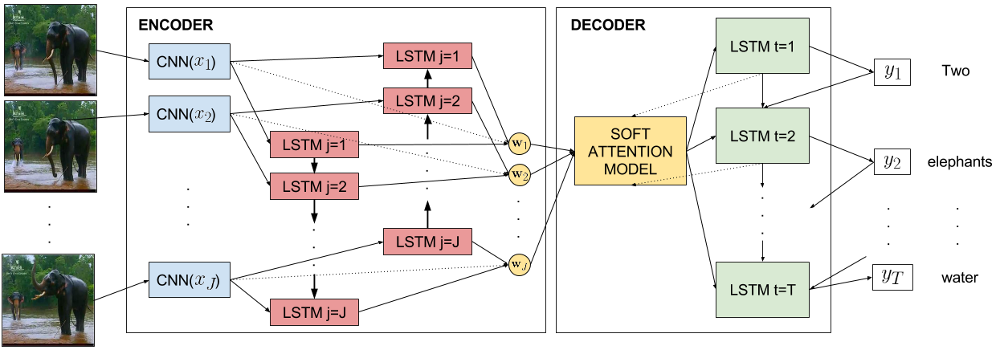

# ABiViRNet: Attention Bidirectional Video Recurrent Net for video captioning


This repository contains the code for building a system similar to the
one from the work [Video Description using Bidirectional Recurrent Neural Networks](https://arxiv.org/abs/1604.03390), 
presented at the [International Conference of Artificial Neural Networks (ICANN'16)](http://icann2016.org/). 
With this module, you can replicate our experiments and easily deploy new models. ABiViRNet is built upon our fork of 
[Keras](https://github.com/MarcBS/keras) framework and tested for the [Theano](http://deeplearning.net/software/theano)
backend.

## Features: 

 * Attention model over the input sequence of frames
 * Peeked decoder LSTM: The previously generated word is an input of the current LSTM timestep
 * MLPs for initializing the LSTM hidden and memory state
 * Beam search decoding

## Architecture



## Installation

ABiViRNet requires the following libraries:

 - [Our version of Keras](https://github.com/MarcBS/keras) v1.0.4 or newer
 - [Staged Keras Wrapper](https://github.com/MarcBS/staged_keras_wrapper) v0.5 or newer
 - [Coco-caption evaluation package] (https://github.com/lvapeab/coco-caption/tree/master/pycocoevalcap/)


## Instructions:

Assuming you have a dataset and features extracted from the video frames:
 
 1) Prepare data:
 
   ``
 python data_engine/subsample_frames_features.py
 ``
  ``
 python data_engine/generate_features_lists.py
 ``
  ``
 python data_engine/generate_descriptions_lists.py
 ``

See [data_engine/README.md](data_engine/README.md) for detailed information.

2) Prepare the inputs/outputs of your model in `data_engine/prepare_data.py`
  
3) Set a model configuration in  `config.py` 
 
4) Train!:

  ``
 python main.py
 ``

## Citation

If you use this code for any purpose, please, do not forget to cite the following paper:

```
Peris Á, Bolaños M, Radeva P, Casacuberta F. Video Description using Bidirectional Recurrent Neural Networks. arXiv preprint arXiv:1604.03390. 2016 Apr 12.
```

## About

Joint collaboration between the [Computer Vision at the University of Barcelona (CVUB)](http://www.ub.edu/cvub/) group at [Universitat de Barcelona](www.ub.edu)-[CVC](http://www.cvc.uab.es) and the [PRHLT Research Center](https://www.prhlt.upv.es) at [Universitat Politècnica de València](https://www.upv.es).


## Contact

Álvaro Peris ([web page](http://lvapeab.github.io/)): lvapeab@prhlt.upv.es 

Marc Bolaños ([web page](http://www.ub.edu/cvub/marcbolanos/)): marc.bolanos@ub.edu
